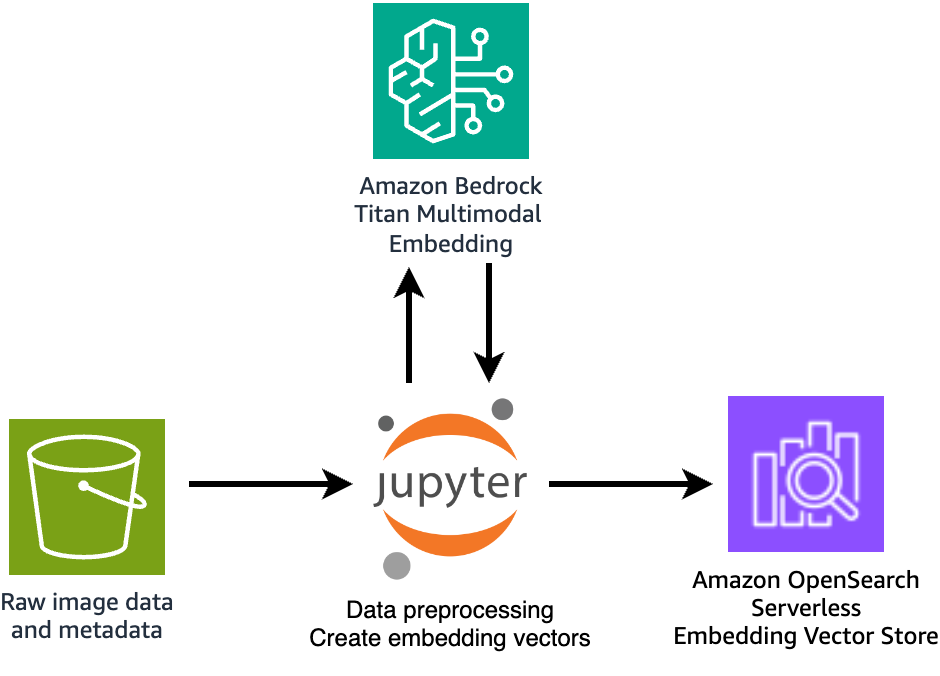
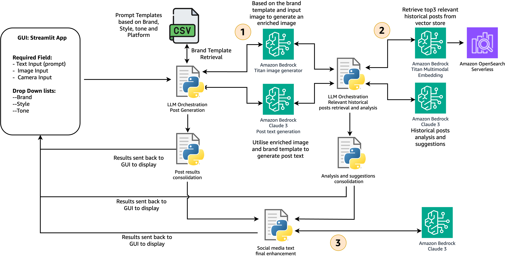

# Build a multimodal social media content generator using Amazon Bedrock
This solution provides you with a Streamlit app to **generate rich and engaging Social Media Post** (image and text) tailored to your audience preference, while adhering to your brand-specific messaging and guidelines. 

<br>


## Pre-requisites
Amazon Bedrock with the following models:
- Amazon Titan Image Generator
- Anthropic Claude 3 Sonnet
- Amazon Titan Multimodal Embedding

Amazon SageMaker domain

## Solution Architecture
1. Data preparation and embedding vector generation architecture
<br>
<div style="text-align:center;">
  
</div>
<br>

2. Social media content generation and enhancement architecture
<br>

<div style="text-align:center;">
  
</div>
<br>

## Step 1: Setup JupyterLab space

1. Go to Amazon SageMaker, Click on Studio > select your user profile and choose Open Studio. 

3. From Applications in the top left, choose JupyterLab. 

4. If you already have a JupyterLab space, choose Run. If you do not, choose Create JupyterLab Space to create one. Enter a name and choose Create Space. 

5. Change instance to ml.t3.large and choose Run Space. 

6. Within a minute, you should see that the JupyterLab space is ready. Choose Open JupyterLab. 

7. In the JupyterLab launcher window, choose Terminal. 

8. Run the following command on the terminal to download the sample code from Github: 

```
git clone https://github.com/aws-samples/Build-a-multimodal-social-media-content-generator-using-Amazon-Bedrock.git
```

## Step 2: Embeddings Generation

1. Go to `embedding-generation` folder and run the notebook `synthetic-data-generation.ipynb`

2. Next, run the notebook `multimodal_embedding_generation.ipynb` to generate the multimodal embeddings and save on Amazon OpenSearch Serverless


## Step 3: Running Streamlit app

1. In the JupyterLab environment, go to File, Choose New, Choose Terminal to open a Terminal.

2. On the terminal change directory to `streamlit-app`  and run

```
cd streamlit-app
pip install requirements.txt
```

3. Start the streamlit app:

```
streamlit run app.py
```

4. You can now open a new browser and go to the following url to start using the solcial media content creation app.

```
https://[USER-PROFILE-ID].studio.[REGION].sagemaker.aws/jupyter/default/proxy/8501/
```

## Cleaning Up

- Delete the S3 bucket and data created

- Delete the Amazon OperSearch Serverless Collection

- Delete SageMaker JupyterLab Space

# License

This library is licensed under the MIT-0 License. See the LICENSE file.

- [License](LICENSE) of the project.
- [Code of Conduct](CODE_OF_CONDUCT.md) of the project.
- [CONTRIBUTING](CONTRIBUTING.md#security-issue-notifications) for more information.
